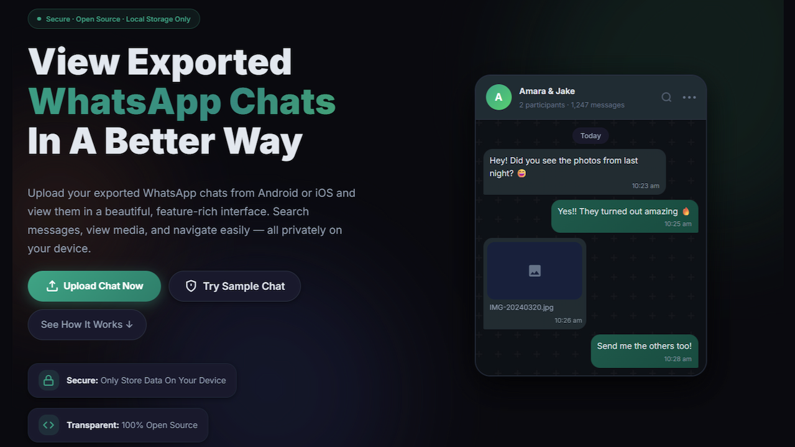

<p align="center">
  
</p>

<h1 align="center">ChatParser</h1>

<p align="center">
  <strong>A private and seamless way to view WhatsApp chat exports.</strong>
</p>

<p align="center">
  
  
  
  
  
  
  
</p>

---

## 📸 Preview

<p align="center">
  
</p>

---

## ✨ Why ChatParser?

WhatsApp allows you to export your chat history, but it leaves you with a raw text file or a messy ZIP that's hard to read and easy to lose. **ChatParser bridges that gap.** 

We transform those raw exports into a premium, interactive experience that feels like the original app—only faster, more searchable, and completely offline.

> [!IMPORTANT]
> **Zero-Server Architecture:** Your chats never leave your device. All parsing and media rendering happen locally in your browser's memory using IndexedDB and modern Web APIs.

---

## 🚀 Key Features

| 🛡️ 100% Private | ⚡ High Performance | 🖼️ Full Media Support |
| :--- | :--- | :--- |
| No data is ever uploaded. Everything stays in your browser's IndexedDB. | Handles 500k+ messages with ease using advanced virtualization. | Native playback for images, videos, audio, and documents. |

| 🔍 Smart Search | 🌓 Dynamic Themes | 📱 Installable PWA |
| :--- | :--- | :--- |
| Filter by date, message type, or instant text search across years of history. | Beautiful Light and Dark modes that respect your system settings. | Install on your phone or desktop and share files directly to it. |

---

## 📂 How It Works

1. **Export:** Open any chat in WhatsApp → Menu → More → **Export Chat**.
2. **Include Media:** Choose "Include Media" to generate a ZIP file (recommended).
3. **Upload:** Drag & drop your `.zip` or `.txt` file into ChatParser.
4. **Relive:** Browse your memories in a beautiful, high-speed interface.

---

## 🛠️ Tech Stack

- **Core:** [React 19](https://react.dev/), [TypeScript](https://www.typescriptlang.org/)
- **Build Tool:** [Vite 8](https://vitejs.dev/)
- **State & Storage:** [IndexedDB (idb)](https://github.com/jakearchibald/idb), [JSZip](https://stuk.github.io/jszip/)
- **Rendering:** [Virtua](https://github.com/inokawa/virtua) for 60FPS list virtualization
- **Experience:** [Vite PWA](https://vite-pwa-org.netlify.app/) for offline support and Share Target API

---

## 💻 Local Development

Want to run ChatParser on your own hardware?

```bash
# Clone the repository
git clone https://github.com/gavirubihan/ChatParser.git

# Install dependencies
npm install

# Start development server
npm run dev

# Build for production
npm run build
```

---

<p align="center">
  Built with ❤️ for privacy and memories.
</p>

<p align="center">
  © 2024 ChatParser · Owned by <a href="https://neovise.me">neovise.me</a> · <a href="https://chatparser.online">Live Site</a>
</p>
